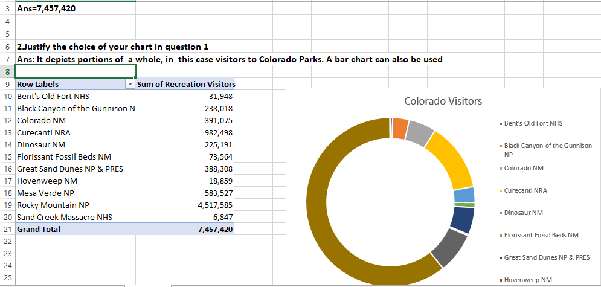
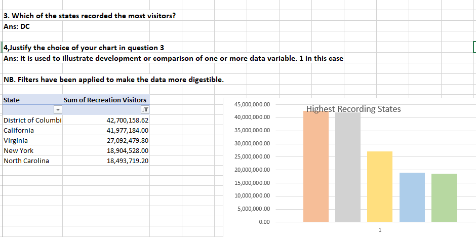
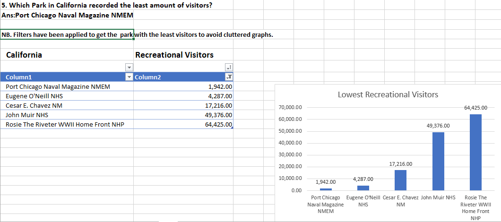
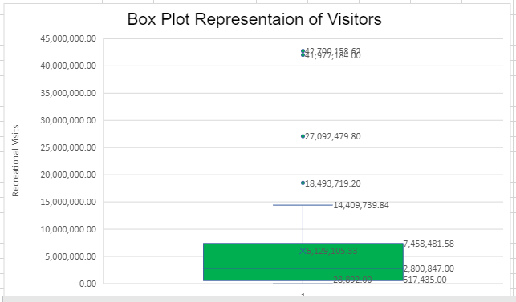

# A-simple-Excel-visualization-repository

## Description
This projects shows the different graphs in excel and how they are applied to answer different questions.Data from the documentation report of the recreation visitors in different states is used.

## Screenshots

## Author
Penina Pendo
